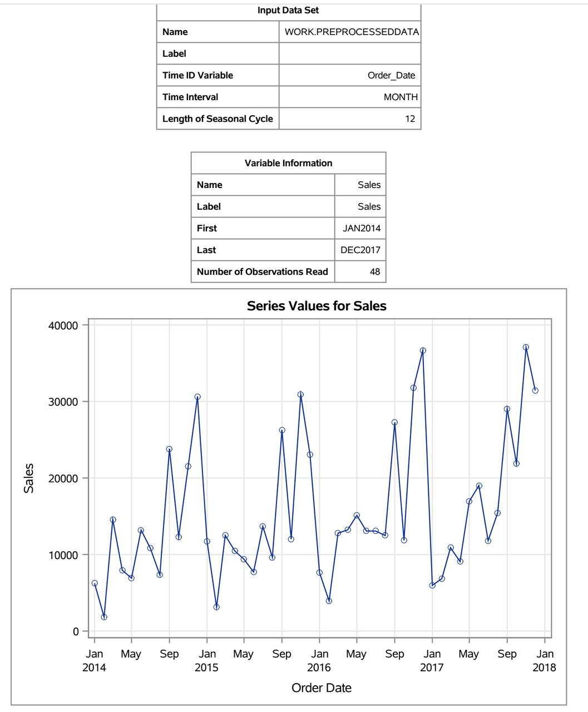
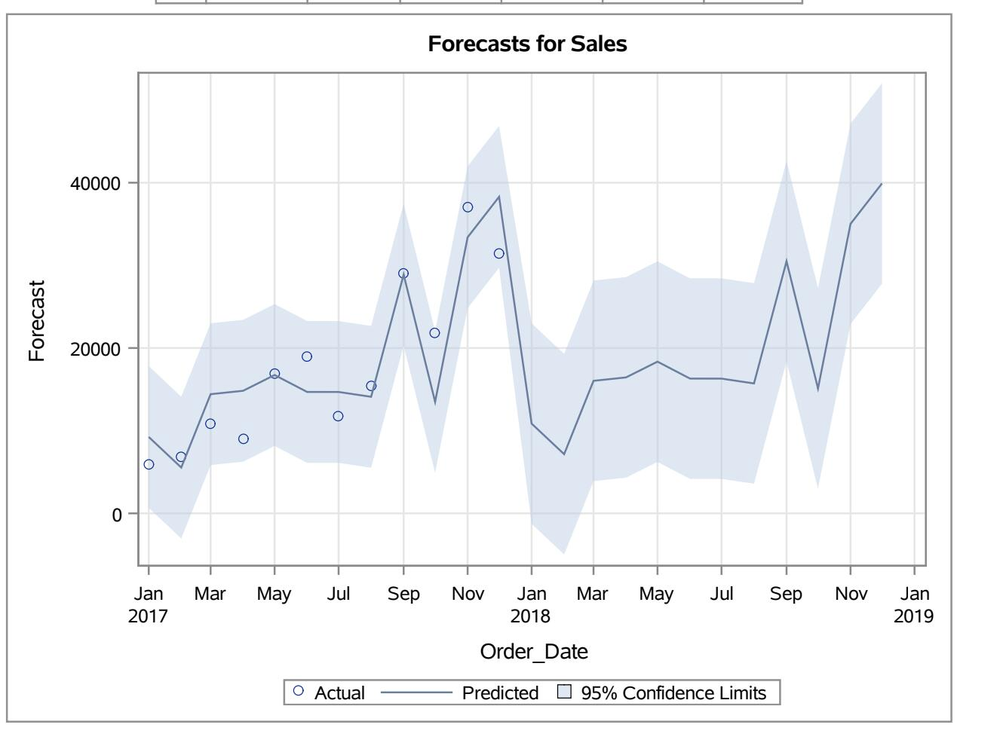
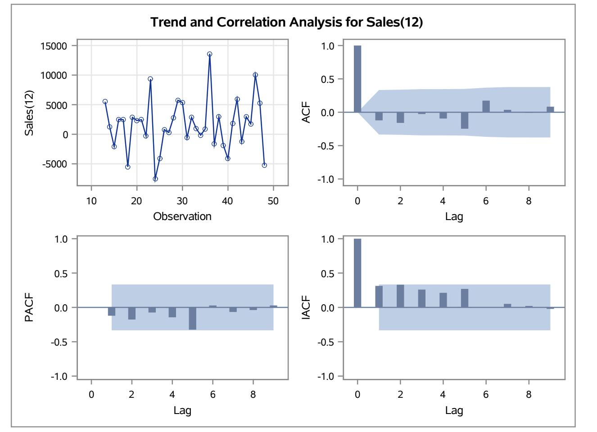

# Sales Forecasting and Time Series Analysis

## Overview

This project focuses on analyzing historical sales data and building a forecasting model to predict future demand. The objective was to understand trends, evaluate temporal dependencies, and support data-driven resource planning decisions.

---

## Dataset

- Time Range: January 2014 – December 2017  
- Frequency: Monthly  
- Total Observations: 48  
- Target Variable: Sales  

The data was preprocessed and structured for time series modeling.

---

## Time Series Analysis

The time series plot shows fluctuations in sales over time with noticeable spikes and dips. The pattern suggests variability in demand without strong consistent seasonality.

---

## Forecasting Results

The forecasting model predicts future sales values along with 95% confidence intervals. The shaded region represents uncertainty in predictions and helps assess forecast reliability.

---

## Correlation Analysis

- ACF (Autocorrelation Function) shows limited correlation across time lags  
- PACF indicates weak dependency on prior observations  
- The series demonstrates low persistence over time  

These observations guided the selection of an appropriate forecasting approach.

---

## Approach

- Aggregated and transformed sales data using SQL  
- Conducted time series analysis to evaluate trends and dependencies  
- Built a forecasting model using SAS  
- Analyzed ACF and PACF plots for correlation insights  
- Generated forecasts with confidence intervals  

---

## Business Impact

- Enabled prediction of future subscription demand  
- Supported resource planning and operational decisions  
- Helped align capacity with expected growth patterns  

---

## Tools and Technologies

- SQL (data aggregation and transformation)  
- SAS (time series forecasting)  
- Python (visualization and analysis)  

---

## Conclusion

This project demonstrates how time series analysis and forecasting can be applied to real-world sales data to generate actionable insights and support strategic planning.
